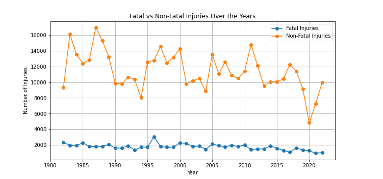

# Phase1-project-aviation
# Project Title — Aviation Risk Analysis
This project analyzes decades of National Transportation Safety Board (NTSB) aviation accident data (1962–2023) to identify the lowest-risk aircraft types for commercial and private enterprise investment.
## Project Overview
This project focuses on analyzing aviation accident data from the National Transportation Safety Board (NTSB), covering incidents between 1962 and 2023 across the United States and international waters. The primary goal is to gain actionable insights into aviation safety and identify patterns that can guide business decisions.

## Business Problem
The company is entering the aviation industry without prior expertise hence we lack a systematic, data-driven approach in assessing aircraft safety and operational risks. Misjudging the risk means making uninformed investment decisions that could jeopardize the success of venturing to the aviation industry and could lead to significant financial loss, operational disruptions, or reputational damage .
Approach: Clean and analyze data, compute trends, compare models & manufacturers, and produce business recommendations.
Goal: is to gain insights into aviation safety and identify patterns that will enable the company to identify low-risk aircraft options and confidently move forward with its aviation investments.

## Objectives
- Assess Aircraft Risk
- Data Cleaning & Preparation
- Analysis & Visualization
- Findings
- Business Recommendations

## Key Visualizations
### Accidents and Incidents Over the Years

### Injuries Severity

### Flight Analysis

### Top Aircraft Events Analyzed by Make

### Top Aircraft Models Accidents

## Dashboard
You can interact with the full dashboard here:  
[View Tableau Dashboard]([https://public.tableau.com/app/profile/jeniffer.mbugua1611/viz/AviationdataProjectWorkbook/AviationSafetyInsightsDashboard]

Or preview below:  
[]

## Findings
1. Accidents over the years
    - Total aviation accidents/incidents peaked in earlier decades and have declined significantly since the 1980s.
    - Fatal events follow the same downward trend, showing safety improvements over time.

2. Aircraft Make & Model Safety
    - Some makes appear frequently in accidents, while others are rarely involved.
    - Among the top makes, certain aircraft have much lower fatality rates compared to peers.
3. Phase of Flight Risk
    - Most accidents occur during takeoff and landing phases, while cruise has far fewer incidents.Landing often has a higher share of fatal outcomes.
4. Weather Conditions
    - The majority of accidents occur in visual meteorological conditions (clear weather) simply because most flights occur in good weather.
    - However, the fatality rate is higher in poor/Instrument Meteorological Conditions (IMC).
5. Injury Severity
    - Many aviation accidents result in no injuries or minor injuries, but a notable share still leads to fatalities.
    - Fatal accidents, while less frequent, are highly impactful.
6. Operator Type
    - Private and general aviation operators account for a disproportionately higher number of accidents compared to commercial airlines.
    - Commercial operators show lower accident and fatality rates due to stricter regulations and safety checks. 
## Recommendations
1. Modern aircraft (post-1990) are generally safer.The company should prioritize newer aircraft models instead of older ones with higher historical risks.
2. The company should invest in aircraft models with consistently low accident frequency and fatality rates.Avoid makes with disproportionately high fatal accidents.
3. Aircraft with advanced autopilot, landing assist, and navigation technologies should be prioritized.Training programs for pilots should emphasize takeoff and landing safety.
4. The company should purchase aircraft with enhanced weather resilience (radar, de-icing, navigation systems).Develop policies to limit risky flights in poor weather.
5. The company should invest in aircraft with strong safety records and crashworthiness.Proactive risk management strategies (maintenance, inspections) can keep fatality rates low.
6. The company should adopt a commercial-grade operational model, even if entering private charter markets.Safety culture and compliance with airline-level standards will minimize risk.

## Appendix
[📄 Aviation Anlysis Presentation Slides (PDF)](Aviation_presentation_slides.pdf)
[📄 Aviation Project Dashboard (PDF)](Aviation_dashboard.pdf)
[📄 Aviation Analysis Notebook](aviation_project.ipynb)
